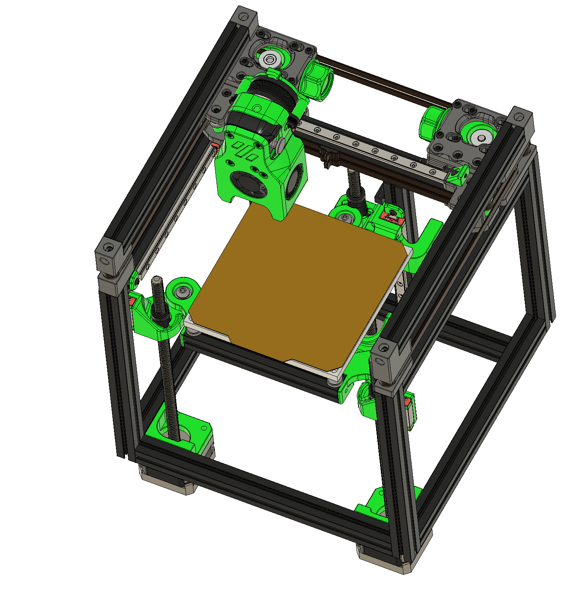

## Voron V0.1 mod with 3 Z steppers like Trident and same build volume of 120x120x120

- Tryfer Bach - Mini Trident (Welsh) 

## The frame is the same. Well, mostly, what changes:
- add 1 extra MGN7 rail
- for bed front extrusion, use MeakerBeam XL 15x15 cube (or cut to 120mm the leftover vertical back extrusion) or buy 300mm MeakerBeam XL and cut 120 mm
- for the 2nd bed extrusion, cut the leftover extra 300 mm MeakerBeam XL to 107.5 mm, as alternative, use 7x 1mm M5 spacers, I've also designed part that can be use with original 100 mm V0.1 bed extrusion with or w/o spacers. 
- you need 2 mm foam tape for the side panels, the MGN7 carriage is 17 mm, the extrusions are 15 mm
- for probe, Super PINDA and later Euclid/Klicky with side swipe system

you will also need a controller board for 6 steppers, you can also use the 2 stepper controller Tircown easy board ERCF connected over USB to RPi and controller with this board the A/B steppers, the rest with the original V0.1 controller board.

Still need to test alternative to cut/add 15x15 cube to the bed front beam. Basically add 10 mm more material to the front bed mount. Just the thermal properties of this solution need to be tested, as the heat from the bed may transfer to the M4 knurled nut, and to the plastic.
In this case, best use M4/M5 Stainless Steel Knurled Thumb Nut, as Stainless Steel will transfer less heat.

## The same goes for the rear bed mount, here are just 7.5 mm

It's basically V0.1 with new Tri Z motion system

