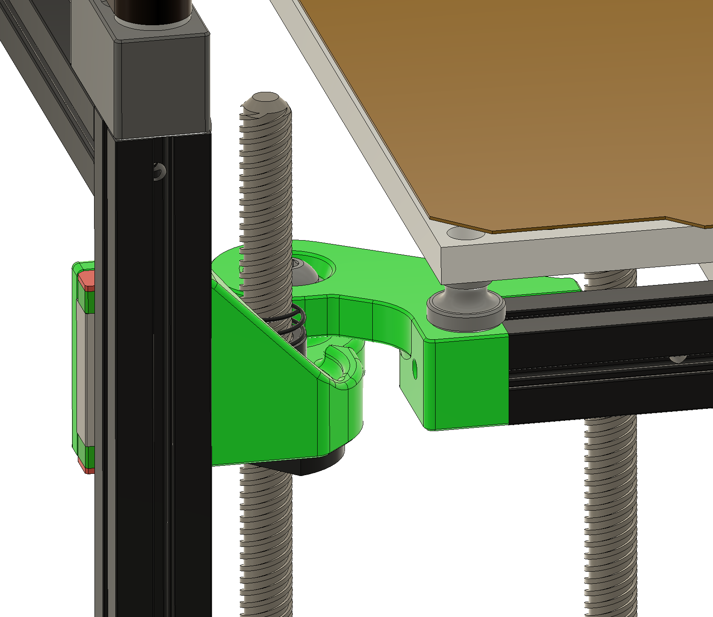
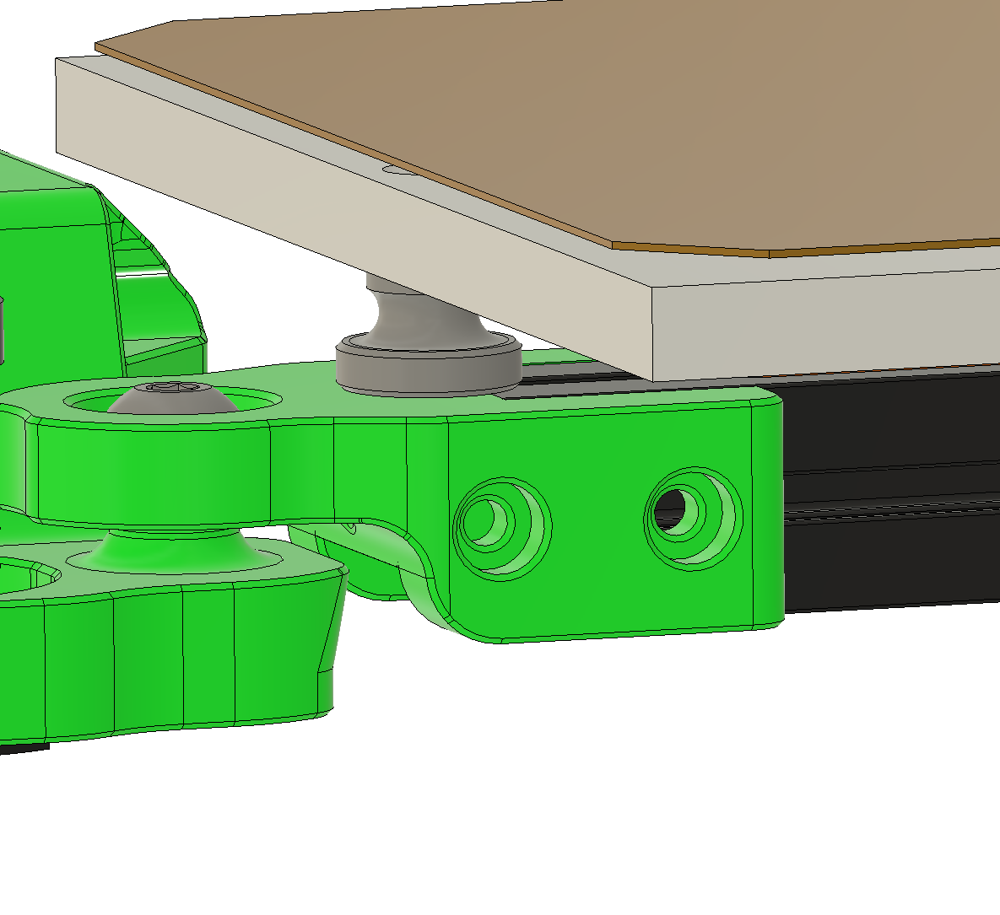
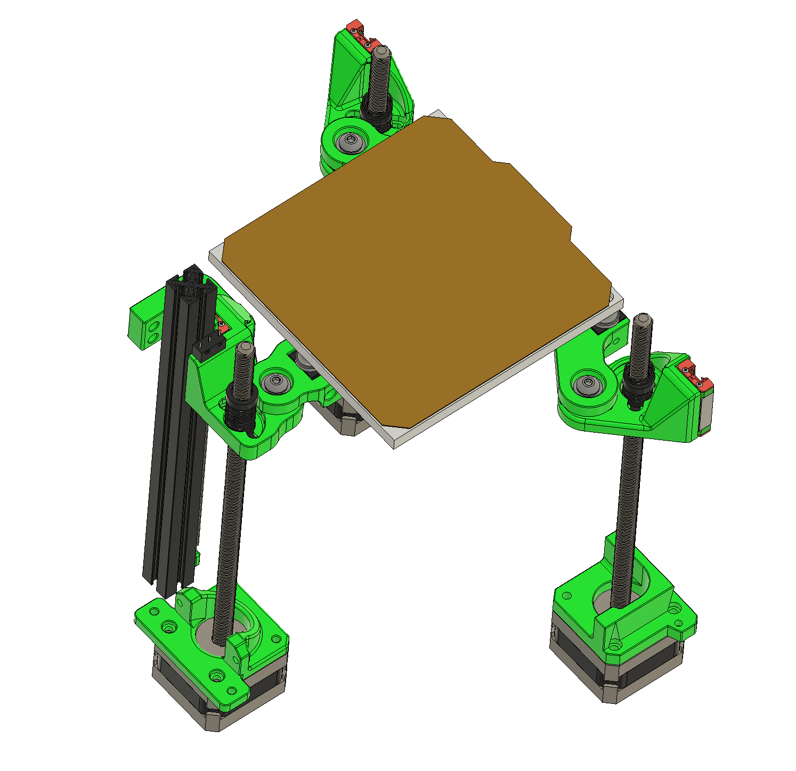

## Voron V0.1 mod with 3 Z steppers like Trident and same build volume of 120x120x120

#The frame is the same. Well, mostly, what changes:
- add 1 extra MGN7 rail
- for bed front extrusion, use MeakerBeam XL 15x15 cube (or cut to 120mm the leftover vertical back extrusion)
- for the 2 bed extrusion, use 7 mm spacer cut out of left over MeakerBeam XL or use 7x 1mm M5 spacers, I've also designed part taht can be use with or w/o spacers. 
- you need 2 mm foam tape for the side panels, the MGN7 carriage is 17 mm, the extrusions are 15 mm

Still need to test alternative to cut/add 15x15 cube to the bed front beam. Basically add 10 mm more material to the front bed mount. Just the thermal properties of this solution need to be tested, as the heat from the bed may transfer to the M4 knurled nut, and to the plastic.

## The same goes for the rear bed mount, here are just 7.5 mm

